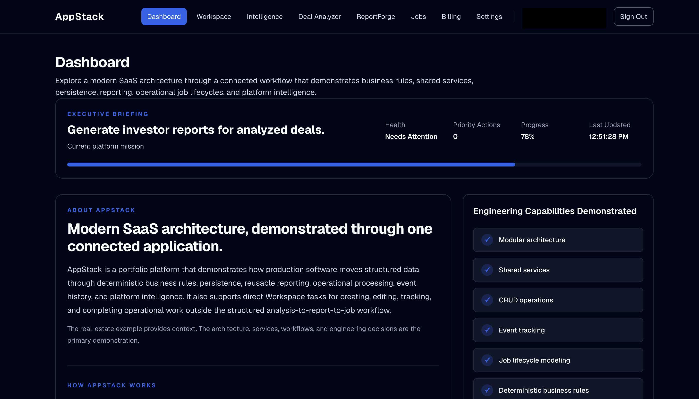
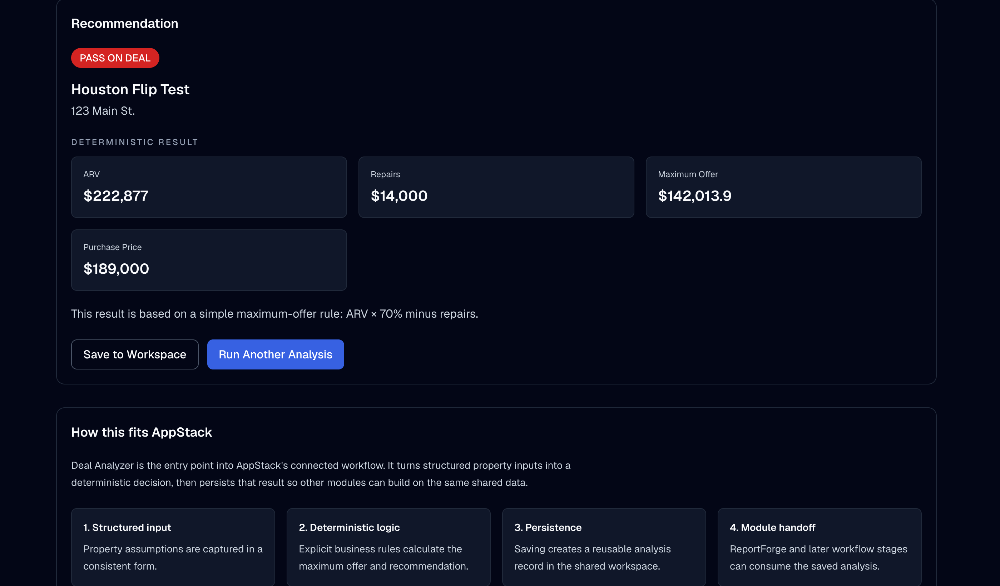
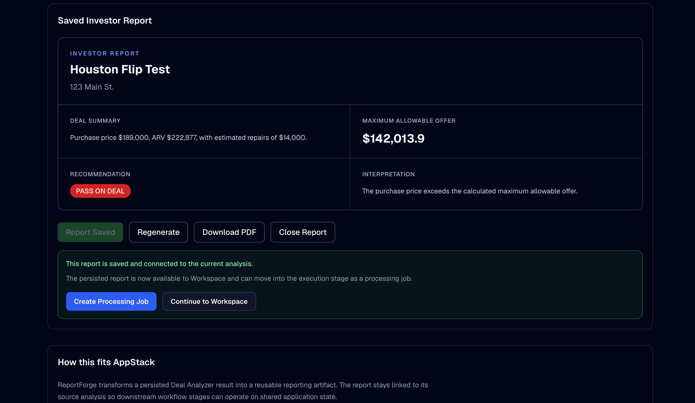
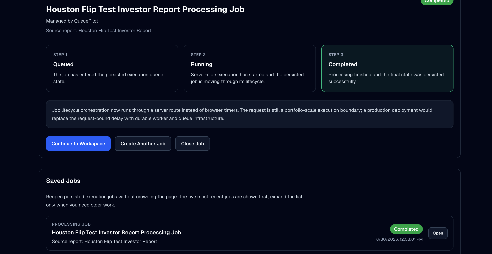
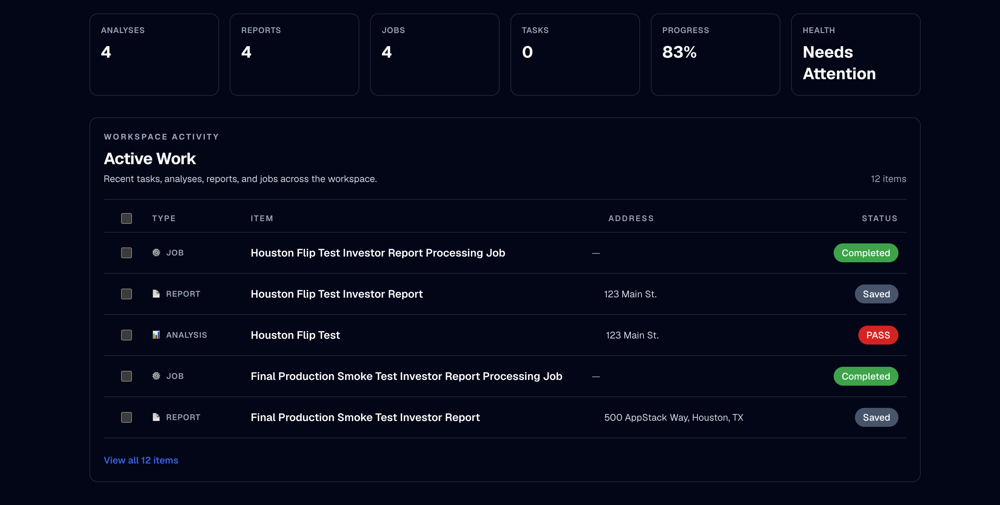
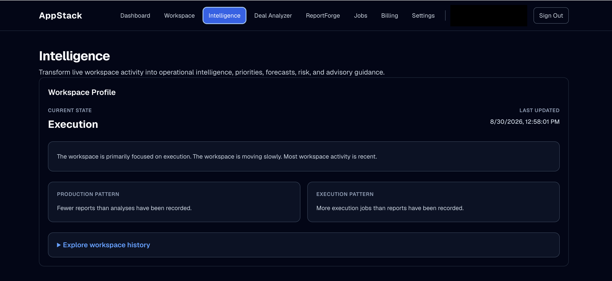
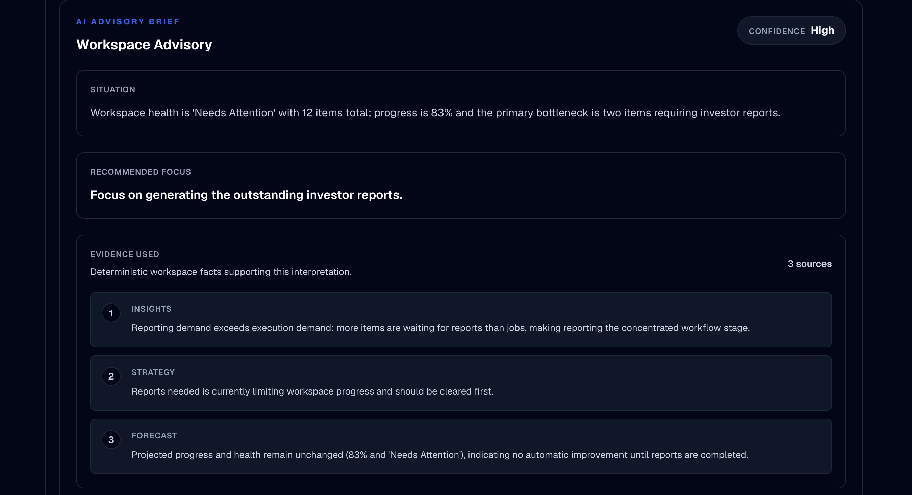
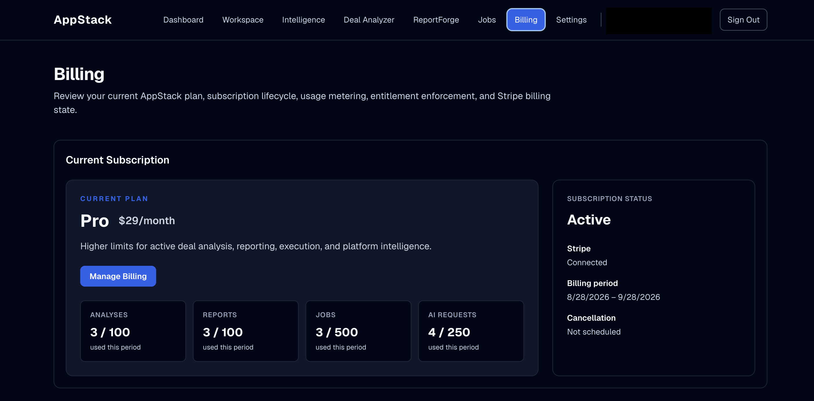

# AppStack

## Production SaaS Architecture & AI Systems Demonstration Platform

AppStack is a production-oriented portfolio application built to demonstrate how modern SaaS systems are architected, integrated, secured, operated, and evolved.

Rather than presenting isolated code samples or disconnected technical exercises, AppStack combines authentication, authorization, persistence, deterministic business logic, event history, workflow orchestration, modeled job lifecycles, subscription billing, usage entitlements, operational intelligence, and AI-assisted decision support inside one cohesive application.

The business workflow provides realistic context.

The architecture is the primary engineering artifact.

---

# Why AppStack Exists

Many software portfolio projects demonstrate individual technical capabilities:

- A CRUD application
- An authentication flow
- A database
- An API integration
- A dashboard
- An AI feature

AppStack was built around a different question:

> What happens when these capabilities must operate together as one system?

The project therefore focuses on the engineering relationships between features.

It explores questions such as:

- Where should business logic live?
- Which layer owns persistence?
- How should modules communicate?
- How should historical activity be preserved?
- How should application state become operational intelligence?
- Where should AI enter the architecture?
- What should remain deterministic?
- How should subscription state affect application behavior?
- How should user data remain isolated?
- How should cross-module relationships survive navigation?
- How should a system communicate capabilities without overstating its infrastructure?

The result is a working SaaS architecture demonstration platform rather than a collection of unrelated examples.

---

# System Overview

AppStack follows a production-oriented application flow:

```text
Authenticated User
        ↓
Application Interface
        ↓
Deterministic Business Logic
        ↓
Persistent Application State
        ↓
Event History
        ↓
Cross-Module Workflows
        ↓
Deterministic Intelligence
        ↓
Structured AI Context
        ↓
AI Advisor
        ↓
Human Decision
```

Subscription state and authorization operate across this flow:

```text
Authentication
      +
Authorization
      +
Billing State
      +
Entitlements
      +
Usage Limits
      ↓
Permitted Application Behavior
```

The system is intentionally designed so that AI does not become the source of application truth.

---

# Product Walkthrough

The screenshots below show AppStack's primary workflow and the architectural responsibilities demonstrated by each stage.

## 1. Dashboard — System Overview



Dashboard provides an operational view of the application, combining persisted activity, workspace health, progress, priority state, and engineering context without becoming the primary management surface.

---

## 2. Deal Analyzer — Deterministic Business Logic



Deal Analyzer converts structured property inputs into a deterministic recommendation using explicit business rules. The resulting analysis can be persisted and reused by downstream modules.

---

## 3. ReportForge — Persistent Reporting & Workflow Handoff



ReportForge transforms a persisted analysis into a reusable investor report while preserving the relationship to its source analysis. A saved report can hand its context directly into the Jobs workflow.

---

## 4. Jobs — Modeled Execution Lifecycle



Jobs demonstrates persisted operational state through a modeled lifecycle of Queued → Running → Completed. The implementation preserves job state and source-report relationships without claiming dedicated distributed queue infrastructure.

---

## 5. Workspace — Shared Operational State



Workspace acts as the central management surface for analyses, reports, jobs, and tasks. It exposes persisted relationships, operational status, search, filtering, selection, and cross-module navigation.

---

## 6. Intelligence — Deterministic Operational Interpretation



Workspace Intelligence interprets authenticated, user-scoped application state to derive health, workflow patterns, priorities, forecasts, risk, strategy, and insights before AI reasoning is introduced.

---

## 7. AI Advisor — Grounded AI Synthesis



The AI Advisor operates downstream of deterministic intelligence. Its advisory output is grounded in structured workspace evidence rather than treating the language model as the application's source of truth.

---

## 8. Billing — SaaS Identity, Entitlements & Usage



Billing connects authenticated identity, persisted subscription state, deterministic entitlements, current-period usage metering, and Stripe sandbox integration into the application's access-control model.

***

# Core Modules

## Dashboard

Dashboard provides high-level operational visibility.

It summarizes:

- Total persisted items
- Analyses
- Reports
- Jobs
- Tasks
- Active job state
- Completed job state
- Workspace health
- Progress
- Priority actions
- Recent platform activity

Dashboard is intentionally not the primary CRUD surface.

Its responsibility is:

```text
Observe
   +
Understand
   +
Navigate
```

Recent activity deep-links into the exact persisted Workspace object so context is preserved across navigation.

---

## Workspace

Workspace is the operational management surface for persisted application objects.

It manages:

```text
Analyses
Reports
Jobs
Tasks
```

Capabilities include:

- Search
- Filtering
- Sorting
- Selection
- Inspection
- Duplication
- Deletion
- Bulk management
- Task management
- Relationship-aware navigation
- Activity history
- Intelligence visibility

Workspace acts as the central operational layer connecting the application's specialized modules.

Its responsibility is:

```text
Inspect
   +
Manage
   +
Coordinate
```

---

## Deal Analyzer

Deal Analyzer demonstrates deterministic business logic.

The module accepts structured deal information such as:

```text
Purchase Price
After Repair Value
Repair Cost
```

and applies deterministic calculations before any AI reasoning occurs.

A representative business rule is:

```text
MAO = ARV × 70% - Repairs
```

The resulting analysis can be persisted and reused by downstream modules.

This demonstrates a central AppStack principle:

> Business rules that must remain stable should not be delegated to probabilistic AI.

---

## ReportForge

ReportForge transforms persisted analysis data into reusable report artifacts.

Its workflow is:

```text
Persisted Analysis
       ↓
Report Generation
       ↓
Persisted Report
```

Reports retain their relationship to the analysis that produced them.

A saved report can then hand its context directly into Jobs without requiring the user to re-enter the same information.

This creates the workflow:

```text
Analysis
   ↓
Report
   ↓
Job
```

while preserving the identity and relationships of the underlying objects.

---

## Jobs

Jobs models operational work as persistent application state.

A job can progress through lifecycle states such as:

```text
Queued
  ↓
Running
  ↓
Completed
```

The current AppStack implementation models and persists this lifecycle progression.

It does **not** claim to operate dedicated distributed queue or worker infrastructure.

That distinction is intentional.

The Jobs module demonstrates architectural concepts such as:

- Persistent operational state
- Lifecycle transitions
- Observable work
- Cross-module handoffs
- Status-driven interfaces
- Intelligence inputs
- Future queue compatibility

A larger system performing genuinely long-running or distributed work could replace this modeled progression with infrastructure such as dedicated workers, retry systems, durable queues, or message brokers.

AppStack does not introduce that infrastructure where the current workload does not require it.

---

## Intelligence

The Intelligence system interprets persisted application state using deterministic logic.

It evaluates information such as:

- Workspace inventory
- Workflow relationships
- Operational state
- Progress
- Incomplete work
- Historical activity
- Current priorities

The intelligence layer produces structured outputs including:

```text
Workspace Health
Bottleneck
Recommended Action
Progress
Priority Actions
Director Plan
Forecast
Risk
Strategy
Insights
```

The architecture follows:

```text
Application Truth
      ↓
Deterministic Interpretation
      ↓
Operational Intelligence
```

This intelligence exists independently of the AI Advisor.

---

## AI Advisor

The AI Advisor sits downstream of deterministic intelligence.

It does not independently invent the application's operational facts.

Instead:

```text
Persisted State
      ↓
Deterministic Intelligence
      ↓
Structured Advisor Context
      ↓
AI Model
      ↓
Advisory Response
```

This architecture allows AI to perform the task it is well suited for:

```text
Interpretation
Reasoning
Explanation
Recommendation
```

while deterministic application logic retains responsibility for:

```text
Business Rules
Application State
Authorization
Entitlements
Usage Limits
Workflow Relationships
Operational Facts
```

The Advisor remains human-in-the-loop.

It recommends.

It does not autonomously execute significant application actions.

---

## Billing & Entitlements

AppStack includes a working Stripe subscription integration using Stripe's sandbox/test-mode environment.

The billing architecture includes:

- Free and Pro application plans
- Stripe Checkout
- Stripe Customer Portal
- Subscription records
- Webhook synchronization
- Billing-period tracking
- Cancellation-state handling
- Usage allowances
- Server-side entitlement enforcement

The authoritative synchronization path is:

```text
Stripe
   ↓
Webhook Event
   ↓
AppStack Webhook Endpoint
   ↓
Subscription Synchronization
   ↓
Application Billing State
   ↓
Entitlements
```

A successful browser redirect from Stripe does not independently establish application billing truth.

Webhook synchronization is responsible for keeping AppStack's persisted subscription state aligned with Stripe.

The current portfolio deployment uses Stripe sandbox/test mode rather than live commercial payment processing.

---

## Authentication & Data Security

AppStack uses Supabase authentication and user-scoped persistence.

The security model includes:

```text
Authentication
      ↓
Authenticated Identity
      ↓
Application Access
      ↓
Row Level Security
      ↓
User-Owned Records
```

Supabase Row Level Security provides database-level enforcement of user ownership.

This prevents the interface from being the only security boundary.

Privileged credentials remain server-side.

---

## Settings

Settings manages user-controlled application preferences.

Current functionality includes profile-related settings and AI assistance preferences.

AI assistance is not treated as a cosmetic interface toggle.

The preference is enforced before model invocation.

Conceptually:

```text
User Preference
      ↓
Server Enforcement
      ↓
AI Access Decision
      ↓
Usage Validation
      ↓
Model Invocation
```

This prevents disabled AI behavior from consuming model usage.

---

# Architecture

AppStack uses a modular monolith architecture.

```text
Next.js Application
│
├── Presentation
│
├── Shared Components
│
├── Feature Modules
│
├── Services
│
├── Deterministic Business Logic
│
├── Intelligence
│
├── Billing & Entitlements
│
├── AI Integration
│
└── Persistence
        ↓
   Supabase / PostgreSQL
```

External capabilities are integrated through explicit boundaries:

```text
AppStack
│
├── Supabase
│     ├── PostgreSQL
│     ├── Authentication
│     └── Row Level Security
│
├── Stripe
│     ├── Checkout
│     ├── Subscriptions
│     ├── Customer Portal
│     └── Webhooks
│
├── OpenAI
│     └── AI Advisor
│
└── Vercel
      └── Production Deployment
```

The application is separated by responsibility without introducing distributed-system infrastructure that the current workload does not require.

---

# Key Architectural Decisions

## Modular Monolith Over Microservices

AppStack keeps modules within one deployable application while preserving explicit internal boundaries.

This provides:

- Lower operational complexity
- Easier local development
- Straightforward deployment
- Shared contracts
- Clear module ownership
- Future extraction paths if scale eventually requires them

The principle is:

> Separate responsibilities before separating deployments.

---

## Services Over Page-Level Business Logic

Reusable application behavior is centralized in services rather than duplicated across pages.

This keeps page components focused primarily on:

```text
User Interaction
      ↓
Service Invocation
      ↓
State
      ↓
Rendering
```

rather than allowing UI components to become the owners of persistence and domain behavior.

---

## Deterministic Knowledge Before AI

AppStack does not ask an AI model to determine facts the application can calculate or establish itself.

Instead:

```text
Business Rules
      ↓
Structured Knowledge
      ↓
Deterministic Intelligence
      ↓
AI Context
      ↓
AI Reasoning
```

This reduces hallucination risk and gives the Advisor a stronger grounding layer.

---

## Events Preserve History

Current state answers:

> What is true now?

Events help answer:

> What happened?

AppStack preserves meaningful application activity so operational history can contribute to system understanding.

This supports the broader principle:

```text
Data
 ↓
Information
 ↓
Knowledge
 ↓
Intelligence
```

---

## Server-Side Entitlement Enforcement

Interface restrictions communicate access.

Server restrictions enforce access.

AppStack therefore does not rely solely on disabled buttons or hidden interface elements to enforce plan limits.

Entitlements are checked at the server boundary before protected operations proceed.

---

## Explicit Cross-Module Relationships

Persisted objects retain enough relationship information for downstream modules to understand where they came from.

For example:

```text
Analysis
   ↓
Report
   ↓
Job
```

This enables data reuse, direct handoffs, and relationship-aware navigation without requiring repeated user input.

---

## Modeled Job Lifecycle Without Infrastructure Theater

AppStack intentionally models job lifecycle state without pretending that a distributed worker system exists.

The current architecture demonstrates:

```text
Job Creation
     ↓
Persisted Job State
     ↓
Lifecycle Progression
     ↓
Observable Status
```

It does not currently provide:

```text
Dedicated Queue Infrastructure
Independent Workers
Distributed Retry Processing
Dead-Letter Queues
Worker Concurrency
```

Those capabilities should be introduced when real workload requirements justify them.

---

# End-to-End Workflow

A representative AppStack workflow is:

```text
1. User authenticates
        ↓
2. Deal information enters Deal Analyzer
        ↓
3. Deterministic business rules calculate the analysis
        ↓
4. Analysis is persisted
        ↓
5. Workspace recognizes the analysis
        ↓
6. ReportForge reuses the persisted analysis
        ↓
7. Report is generated and persisted
        ↓
8. Report context is handed into Jobs
        ↓
9. Job lifecycle is modeled and persisted
        ↓
10. Events preserve meaningful history
        ↓
11. Intelligence evaluates current system state
        ↓
12. Priority, forecast, risk, strategy, and insights are derived
        ↓
13. Structured intelligence becomes AI Advisor context
        ↓
14. Advisor produces a grounded recommendation
        ↓
15. User decides what action to take
```

Authentication, authorization, billing, entitlements, and user isolation operate across this workflow rather than existing as disconnected features.

---

# Technology Stack

## Application

- Next.js
- React
- TypeScript
- Tailwind CSS

## Data & Authentication

- Supabase
- PostgreSQL
- Supabase Auth
- Row Level Security

## Billing

- Stripe Checkout
- Stripe Subscriptions
- Stripe Customer Portal
- Stripe Webhooks
- Sandbox/test-mode billing environment

## AI

- OpenAI API
- Structured application context
- Server-controlled AI access
- Usage metering

## Deployment & Development

- Vercel
- Git
- GitHub
- npm

The stack is intentionally conventional.

The architectural value comes from how the technologies are composed rather than from maximizing the number of technologies used.

---

# Production Engineering Practices

AppStack includes production-oriented engineering practices such as:

- Environment-based configuration
- Server-side secret management
- Authenticated routes
- User-scoped persistence
- Row Level Security
- Stripe webhook verification
- Subscription synchronization
- Server-side entitlement enforcement
- AI usage metering
- Explicit loading states
- Error handling
- Persisted workflow state
- Cross-module relationships
- Responsive interface behavior
- Production deployment
- Manual production smoke verification
- Build verification
- Workflow regression checks
- Architectural documentation

The objective is not merely to make the happy path work.

The application is designed around the assumption that software must continue behaving correctly across state changes, failures, user boundaries, and external integrations.

---

# Repository Structure

```text
app/
├── api/
├── billing/
├── components/
├── dashboard/
├── deal-analyzer/
├── intelligence/
├── jobs/
├── login/
├── reportforge/
├── settings/
└── workspace/

lib/
├── billing
├── events
├── intelligence
├── persistence
├── recommendations
├── workspace
└── supporting services

docs/
├── ARCHITECTURE.md
├── SYSTEM_WORKFLOW.md
├── INTELLIGENCE_PIPELINE.md
├── ENGINEERING_DECISIONS.md
├── MODULE_GUIDE.md
├── TECHNOLOGY_STACK.md
└── LESSONS_LEARNED.md
```

The exact implementation may evolve, but the repository is organized around separation of responsibilities rather than feature accumulation.

---

# Engineering Principles

Several principles guided AppStack throughout development:

1. **Architecture before features**
2. **Separate responsibilities clearly**
3. **Centralize reusable business behavior**
4. **Persist operational knowledge**
5. **Preserve meaningful history**
6. **Establish deterministic truth before probabilistic reasoning**
7. **Enforce security at the correct boundary**
8. **Keep external providers behind explicit boundaries**
9. **Make operational state observable**
10. **Prefer maintainability over unnecessary complexity**
11. **Treat documentation as engineering**
12. **Refine existing workflows before accumulating new features**
13. **Do not claim infrastructure that the system does not actually operate**

These principles influenced both the system's implementation and the decisions to remove or simplify functionality when additional complexity did not improve the architecture.

---

# What AppStack Demonstrates

AppStack brings together several engineering disciplines within one working application.

## Software Architecture

- Modular monolith design
- Separation of concerns
- Service boundaries
- Reusable components
- Explicit responsibility ownership
- Dependency management
- Cross-module workflows

## Application Engineering

- CRUD operations
- Persistent state
- Deterministic business logic
- Modeled job lifecycles
- Event history
- Search, filtering, and sorting
- Deep-link navigation
- Responsive UI

## Data Engineering

- PostgreSQL persistence
- User-owned records
- Relational application data
- Metadata-based workflow relationships
- Row Level Security
- State/history distinction

## SaaS Engineering

- Authentication
- Subscription state
- Stripe sandbox integration
- Webhooks
- Customer billing management
- Entitlements
- Usage limits
- Server-side enforcement

## AI Systems Engineering

- Deterministic knowledge before AI
- Structured context
- Controlled model invocation
- Usage metering
- Grounded advisory
- Human-in-the-loop decision support
- Separation between probabilistic reasoning and application truth

## Production Engineering

- Environment configuration
- Secret boundaries
- Deployment
- Build verification
- Manual production smoke verification
- Failure analysis
- Production debugging
- Regression checks
- Documentation

The value of AppStack is not any one of these capabilities in isolation.

It is their integration into one understandable system.

---

# Documentation

The deeper engineering documentation is maintained in the `docs/` directory.

| Document | Purpose |
| --- | --- |
| [Case Study](docs/CASE_STUDY.md) | Engineering journey, architectural evolution, major challenges, production debugging, decisions, tradeoffs, and lessons from building AppStack |
| [Architecture](docs/ARCHITECTURE.md) | System organization, boundaries, layers, persistence, security, billing, AI, and deployment architecture |
| [System Workflow](docs/SYSTEM_WORKFLOW.md) | End-to-end movement of information and work through the application |
| [Intelligence Pipeline](docs/INTELLIGENCE_PIPELINE.md) | Deterministic intelligence architecture and the bounded AI Advisor layer |
| [Engineering Decisions](docs/ENGINEERING_DECISIONS.md) | Major architectural decisions, tradeoffs, consequences, and revisit criteria |
| [Module Guide](docs/MODULE_GUIDE.md) | Responsibilities, inputs, outputs, and boundaries of the major application modules |
| [Technology Stack](docs/TECHNOLOGY_STACK.md) | Technologies used by AppStack, their responsibilities, and why they were selected |
| [Lessons Learned](docs/LESSONS_LEARNED.md) | Engineering lessons discovered while building, integrating, debugging, and deploying the system |

The README provides the system-level overview.

The deeper documentation explains how the architecture works and why its major decisions were made.

---

# Running Locally

Install dependencies:

```bash
npm install
```

Start the development server:

```bash
npm run dev
```

Create the required local environment configuration for:

```text
Supabase
Stripe
OpenAI
Application URL
```

Secrets and production credentials should never be committed to the repository.

---

# Project Status

AppStack has completed its primary architecture and production-workflow implementation.

Core systems include:

- Authentication
- User-scoped persistence
- Deterministic business logic
- Workspace CRUD
- Reporting
- Modeled job workflows
- Event history
- Deterministic intelligence
- AI-assisted advisory
- Stripe sandbox subscription integration
- Billing synchronization
- Server-side entitlements
- AI usage metering
- Application settings
- Production deployment

The current focus is documentation, portfolio presentation, and preservation of the architectural decisions demonstrated by the completed system.

AppStack is a production-deployed portfolio system with production-oriented architecture.

It should not be confused with a claim of commercial-scale infrastructure or a fully automated enterprise test environment.

---

# Closing Perspective

AppStack began as an application-building exercise and evolved into a study of systems engineering.

The most important improvements did not always come from adding features.

They came from defining responsibilities more clearly, moving logic to the correct boundaries, preserving system history, strengthening security, connecting previously isolated workflows, enforcing business rules deterministically, verifying production behavior, and removing complexity that did not justify itself.

The result is a working application, but the deeper artifact is the architecture behind it.

**AppStack demonstrates how individual software capabilities become a system when data, rules, state, history, workflows, security, billing, intelligence, and AI are designed to work together intentionally.**